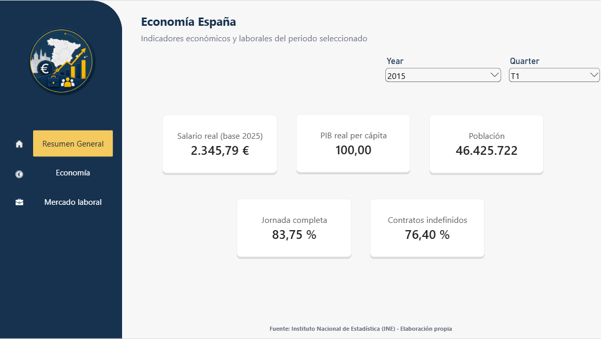
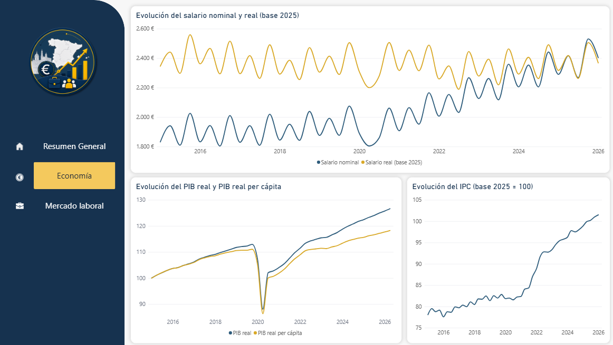
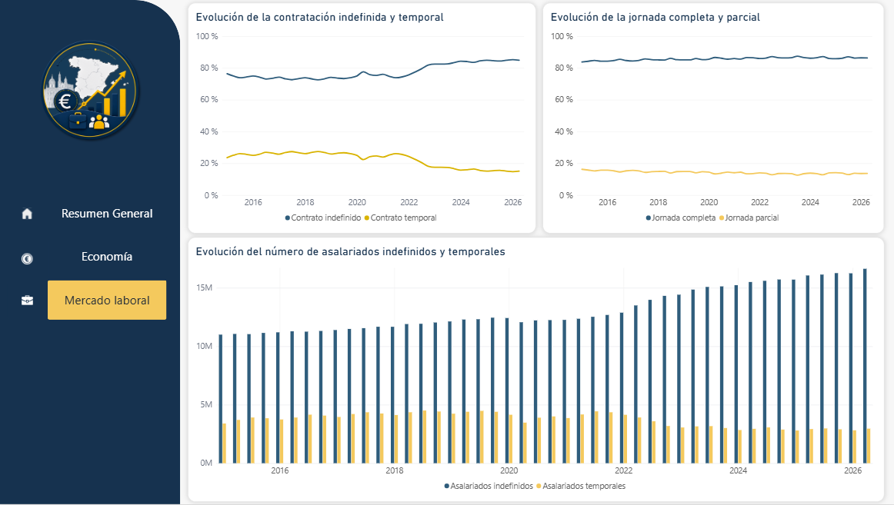

# Economía de España 2015–2026 · Data Engineering Project

<p align="center">
  
  
  
  
  
  
  
  
  
</p>

## 📌 Descripción

Proyecto end-to-end de **Data Engineering + Business Intelligence** construido para analizar la evolución de la economía española entre **2015 y 2026** a partir de datos oficiales del **Instituto Nacional de Estadística (INE)**.

La pregunta que guía el proyecto es sencilla:

> **¿Vivimos mejor en España que en 2015?**

Para responderla no se utiliza un único indicador. El proyecto combina evolución de precios, salarios, PIB real, población, contratación y jornada laboral, construyendo un pipeline automatizado que lleva los datos desde la API del INE hasta un dashboard final en Power BI.

El objetivo no es únicamente obtener gráficos, sino demostrar un flujo completo de ingeniería de datos:

**extracción → almacenamiento Bronze → transformación Silver → métricas Gold → orquestación → visualización.**

---

## 🎯 Objetivos

- Extraer automáticamente series económicas y laborales desde la API del INE.
- Mantener una capa **Bronze** con los datos originales.
- Limpiar, normalizar y transformar los datos con **PySpark** en Databricks.
- Construir métricas analíticas en una capa **Gold**.
- Automatizar el pipeline con **Apache Airflow** ejecutado mediante Docker.
- Descargar automáticamente las tablas Gold desde Databricks al entorno local.
- Construir un modelo en estrella en **Power BI**.
- Analizar si el crecimiento económico se ha trasladado también al ciudadano medio.

---

## 🏗️ Arquitectura


### Flujo automatizado en Airflow

```text
extract_ine_data
        ↓
upload_bronze_to_databricks
        ↓
run_bronze_to_silver
        ↓
run_silver_to_gold
        ↓
run_export_gold
        ↓
download_gold_to_local
```

El DAG está programado para ejecutarse diariamente a las **00:00**.

> [!NOTE]
> La orquestación es local: el equipo, Docker Desktop y los contenedores de Airflow deben estar encendidos para que la ejecución programada tenga lugar.

---

## 🛠️ Tecnologías

| Tecnología | Uso en el proyecto |
|---|---|
| **Python** | Extracción desde la API del INE y lógica auxiliar |
| **Requests / JSON** | Consumo y almacenamiento de datos crudos |
| **Databricks** | Entorno de procesamiento y almacenamiento |
| **PySpark** | Limpieza, transformación, joins, ventanas y métricas |
| **Delta Tables** | Persistencia de las capas Silver y Gold |
| **Apache Airflow** | Orquestación end-to-end |
| **Docker / Docker Compose** | Ejecución local de Airflow |
| **Power BI** | Modelo analítico y visualización |
| **Git / GitHub** | Control de versiones y portfolio |

---

## 📊 Datos utilizados

Los datos proceden de la **API oficial del Instituto Nacional de Estadística (INE)**.

| Indicador | Serie INE | Uso |
|---|---:|---|
| PIB real | `CNTR6652` | Evolución de la producción real |
| Población | `ECP320` | Contexto demográfico y PIB real per cápita |
| Ocupados | `EPA387796` | Serie laboral extraída |
| Tasa de desempleo | `EPA423474` | Serie laboral extraída |
| Asalariados indefinidos | `EPA400155` | Contratación |
| Asalariados temporales | `EPA400159` | Contratación |
| Jornada completa | `EPA404360` | Tipo de jornada |
| Jornada parcial | `EPA404362` | Tipo de jornada |
| Salario | `ETCL1527` | Salario nominal y salario real |
| IPC general | `IPC290751` | Evolución de precios y deflactación salarial |

El periodo configurado para la extracción es **2015–2026**.

> [!IMPORTANT]
> Algunas series de 2026 todavía contienen información parcial. Las comparaciones con 2026 deben interpretarse teniendo en cuenta la disponibilidad de cada indicador.

---

## 🥉🥈🥇 Arquitectura Medallion

### Bronze

Datos originales obtenidos directamente de la API del INE en formato JSON.

```text
data/bronze/
```

Los archivos también se cargan a un Databricks Volume:

```text
/Volumes/workspace/economia_espana/bronze
```

La capa Bronze conserva la información recibida sin aplicar transformaciones analíticas.

### Silver

Transformación con PySpark:

- explosión y normalización de estructuras JSON;
- extracción de `year` y `quarter`;
- tratamiento de nulos;
- conversión del IPC mensual a frecuencia trimestral mediante media;
- adaptación de población a frecuencia trimestral;
- interpolación de observaciones históricas de población;
- normalización de las diferentes series;
- persistencia como tablas Delta.

Tablas Silver principales:

```text
cpi_silver
employed_silver
full_time_silver
gdp_real_silver
indefinite_silver
part_time_silver
population_silver
salary_silver
temporary_silver
unemployment_rate_silver
```

### Gold

La capa Gold combina las series Silver y genera métricas preparadas para análisis.

```text
employment_contract_gold
work_schedule_gold
purchasing_power_gold
population_quarterly_gold
gdp_per_capita_gold
```

Estas tablas se exportan automáticamente a CSV y Airflow las descarga a:

```text
data/gold/
```

---

## 🧮 Métricas principales

### Salario real — base de precios 2025

El salario nominal indica los euros cobrados en cada periodo, pero no cuánto pueden comprar esos euros.

Para hacer comparables los salarios a lo largo del tiempo se utiliza el IPC:

```text
salario_real_base_2025 =
salario_nominal × (100 / IPC_periodo)
```

Con `IPC 2025 = 100`.

El resultado expresa cada salario utilizando el **nivel de precios de 2025**.

---

### PIB real per cápita — índice base 2015 T1 = 100

La serie `CNTR6652` es un **índice de volumen de PIB real**, no una cantidad de euros.

Por ello no se divide directamente entre población para obtener `€/habitante`.

Se construye un índice relativo:

```text
PIB real per cápita =
(PIB real / PIB real base 2015 T1)
────────────────────────────────── × 100
(Población / Población base 2015 T1)
```

Interpretación:

```text
100  → mismo nivel que 2015 T1
110  → aproximadamente +10 % de producción real por habitante
90   → aproximadamente -10 % de producción real por habitante
```

Este indicador **no mide salario, renta individual ni productividad por hora trabajada**. Mide la evolución de la producción real media por habitante.

---

### Contratación

```text
% indefinidos =
indefinidos / (indefinidos + temporales) × 100

% temporales =
temporales / (indefinidos + temporales) × 100
```

---

### Jornada laboral

```text
% jornada completa =
jornada completa / (completa + parcial) × 100

% jornada parcial =
jornada parcial / (completa + parcial) × 100
```

---

## 👥 Tratamiento de la población

La población no presentaba la misma frecuencia en todo el periodo.

En los años históricos existían observaciones semestrales, mientras que las métricas finales del proyecto trabajan por trimestre.

Para mantener una serie trimestral se utilizaron ventanas de Spark para localizar la observación anterior y posterior:

```text
previous_population
next_population
```

Cuando faltaba un trimestre intermedio:

```text
population_quarterly =
(previous_population + next_population) / 2
```

Cada registro conserva además el origen del dato:

```text
observed
interpolated
```

---

## 📈 Dashboard de Power BI

El dashboard final está dividido en tres páginas.

### 1. Resumen General

Vista rápida del trimestre seleccionado:

- salario real;
- PIB real per cápita;
- población;
- porcentaje de jornada completa;
- porcentaje de contratos indefinidos.

<p align="center">
  
</p>

### 2. Economía

Responde principalmente a tres preguntas:

- ¿Cómo han evolucionado salario nominal y salario real?
- ¿Cómo han evolucionado los precios?
- ¿Cómo han evolucionado PIB real y producción real por habitante?

<p align="center">
  
</p>

### 3. Mercado laboral

Analiza:

- peso de asalariados indefinidos y temporales;
- jornada completa frente a jornada parcial;
- evolución absoluta de asalariados indefinidos y temporales.

<p align="center">
  
</p>

El archivo completo de Power BI está disponible en:

```text
powerbi/españa_graficos.pbix
```

Las capturas permiten consultar el resultado sin necesidad de instalar Power BI Desktop.

---

## 🔎 Principales conclusiones

### 1. España produce claramente más que en 2015

El PIB real mantiene una tendencia ascendente a largo plazo, con una caída excepcional en 2020 coincidiendo con la pandemia de COVID-19 y una recuperación posterior.

Comparando **2015 T1 con 2026 T2**, el índice de PIB real pasa aproximadamente de `100,03` a `126,64`.

Eso equivale a un crecimiento real cercano al **26,6 %** respecto al inicio del análisis.

En términos sencillos:

> **España produce hoy bastante más cantidad de bienes y servicios que en 2015, descontando el efecto de los precios.**

---

### 2. También producimos más por habitante, pero el avance es menor

El índice construido de PIB real per cápita pasa de `100` en 2015 T1 a aproximadamente `118,27` en 2026 T2.

Esto supone cerca de un **18,3 % más de producción real por habitante** que al comienzo del periodo.

Por tanto, el crecimiento del país **no se explica solamente porque haya más población**: también ha aumentado la producción real media por persona.

Sin embargo, la producción total ha crecido más que la producción por habitante.

```text
PIB real total:       ≈ +26,6 %
PIB real per cápita:  ≈ +18,3 %
```

En lenguaje cotidiano:

> **El país se ha hecho económicamente más grande y cada habitante representa de media más producción que en 2015, pero el crecimiento por persona ha sido bastante menor que el crecimiento total.**

Si en un periodo el PIB real sube mientras el PIB real per cápita baja, la interpretación es diferente: la economía total produce más, pero la población está creciendo a un ritmo suficiente para que la producción media por habitante disminuya.

---

### 3. Los salarios han subido mucho en euros, pero mucho menos en poder de compra

En 2015 T1:

```text
Salario nominal:             1.831,70 €
Salario real a precios 2025: 2.345,79 €
```

En 2026 T1:

```text
Salario nominal:             2.403,80 €
Salario real a precios 2025: 2.367,99 €
```

Entre ambos periodos:

```text
Salario nominal: ≈ +31,2 %
Salario real:    ≈ +0,9 %
```

Esta diferencia es una de las conclusiones más importantes del proyecto.

> **Hoy se cobran muchos más euros que en 2015, pero una gran parte de esa subida ha sido absorbida por el aumento de los precios.**

Por tanto, observar únicamente el salario nominal puede dar una impresión exagerada de mejora.

El salario real aproxima mejor el **poder adquisitivo salarial**, aunque no permite afirmar por sí solo que la calidad de vida general haya mejorado o empeorado. Vivienda, patrimonio, impuestos, estructura familiar o consumo individual quedan fuera de esta métrica.

---

### 4. Los precios aceleran especialmente a partir de 2021

El IPC muestra una evolución relativamente contenida durante la primera parte del periodo y una subida mucho más intensa a partir de 2021.

Esto ayuda a explicar por qué las subidas del salario nominal no se convierten automáticamente en una mejora equivalente del salario real.

En términos simples:

> **Cobrar más no significa necesariamente poder comprar más si los precios también han aumentado.**

---

### 5. Los contratos indefinidos ganan peso frente a los temporales

En 2015 T1, los contratos indefinidos representaban aproximadamente el **76,4 %** del conjunto analizado.

En los últimos años del periodo su peso se sitúa alrededor del **85 %**, mientras que la temporalidad pierde peso.

También se observa un aumento claro del número absoluto de asalariados clasificados como indefinidos.

Sin embargo, hay una limitación importante:

> La categoría de **indefinidos** utilizada por el INE agrupa diferentes modalidades contractuales.

Por ello, este proyecto puede afirmar que ha aumentado su peso estadístico, pero **no que todos esos contratos tengan la misma estabilidad, duración efectiva o calidad laboral**.

---

### 6. La estructura de jornada laboral cambia poco

La jornada completa sigue siendo claramente mayoritaria.

```text
2015:
Jornada completa → 83,75 %
Jornada parcial  → 16,25 %

2025:
Jornada completa → 86,32 %
Jornada parcial  → 13,68 %
```

Existe una mejora hacia la jornada completa de aproximadamente **2,6 puntos porcentuales**, pero no se observa una transformación radical de la estructura laboral.

La distribución se mantiene bastante estable durante todo el periodo.

---

## 🧭 Entonces, ¿vivimos mejor que en 2015?

Si hay que responder de forma clara:

> **España ha mejorado como economía desde 2015, pero esa mejora ha llegado con mucha menos fuerza al poder adquisitivo salarial.**

El país:

- produce bastante más en términos reales;
- también produce más por habitante;
- tiene un mayor peso de asalariados clasificados como indefinidos;
- mantiene una ligera mejora en el peso de la jornada completa.

Pero al mismo tiempo:

- los precios han aumentado con fuerza;
- el salario nominal ha crecido alrededor de un 31 % entre 2015 T1 y 2026 T1;
- al expresar ambos salarios con el mismo nivel de precios, el salario real apenas cambia alrededor de un 1 % entre esos dos periodos.

La conclusión principal del análisis es:

> **España es hoy una economía más grande y produce más por habitante, pero el bolsillo del asalariado no ha mejorado en la misma proporción.**

Por tanto, si la pregunta se centra en si **un salario permite comprar claramente más que en 2015**, los datos de este proyecto no muestran una mejora comparable al crecimiento que observamos en el PIB o en el salario nominal.

---

## ⭐ Limitaciones del análisis

Este proyecto pretende responder una pregunta amplia utilizando indicadores concretos. Existen límites que deben tenerse en cuenta:

- el PIB per cápita es una media y no describe cómo se distribuye la renta;
- PIB per cápita no equivale a productividad laboral;
- el IPC general representa una cesta media y no refleja exactamente el gasto de cada hogar;
- vivienda y alquiler pueden evolucionar de forma diferente a la cesta general;
- salario real no equivale por sí solo a calidad de vida;
- la categoría de contratos indefinidos agrupa diferentes modalidades;
- no se analizan impuestos, patrimonio, desigualdad o renta disponible;
- algunas series de 2026 todavía son parciales;
- parte de la población histórica trimestral ha sido interpolada debido a la frecuencia original de la serie.

Estas limitaciones son importantes para no extraer conclusiones que los datos no pueden sostener.

---

## 🧩 Modelo de Power BI

Se creó una dimensión temporal común:

```text
DimPeriod
```

con:

```text
period_key
year
quarter
date
```

Las tablas Gold se conectan mediante relaciones:

```text
DimPeriod (1) ───── (*) Gold
```

con filtrado en dirección simple desde la dimensión hacia las tablas de hechos.

Este modelo evita relaciones directas entre las tablas Gold y permite que una misma selección temporal filtre todas las métricas de forma consistente.

---

## 📁 Estructura del repositorio

```text
spain-economy-data-engineering/
│
├── airflow/
│   ├── dags/
│   │   └── economia_espana_dag.py
│   └── docker-compose.yaml
│
├── config/
│   └── series.py
│
├── data/
│   ├── bronze/
│   └── gold/
│       ├── employment_contract_gold.csv
│       ├── gdp_per_capita_gold.csv
│       ├── population_quarterly_gold.csv
│       ├── purchasing_power_gold.csv
│       └── work_schedule_gold.csv
│
├── databricks/
│   └── notebooks/
│       ├── 01_bronze_to_silver.py
│       ├── 02_silver_to_gold.py
│       └── 03_export_gold_to_volume.py
│
├── docs/
│   └── images/
│       ├── powerbi_resumen_general.png
│       ├── powerbi_economia.png
│       └── powerbi_mercado_laboral.png
│
├── powerbi/
│   └── españa_graficos.pbix
│
├── src/
│   ├── extraction/
│   │   └── ine_client.py
│   ├── loading/
│   │   ├── databricks_uploader.py
│   │   └── databricks_downloader.py
│   └── orchestration/
│       └── databricks_jobs.py
│
├── .gitignore
└── README.md
```

---

## ⚙️ Ejecución

### 1. Extracción manual

Desde la raíz del proyecto:

```bash
python -m src.extraction.ine_client
```

Los JSON se guardan en:

```text
data/bronze/
```

---

### 2. Configuración de Databricks

Las credenciales no se versionan en Git.

El entorno de Airflow necesita disponer de:

```text
DATABRICKS_HOST
DATABRICKS_TOKEN
```

además de los identificadores de los jobs de Databricks utilizados por el DAG.

> [!WARNING]
> Nunca deben añadirse tokens, secretos o archivos `.env` al repositorio.

---

### 3. Arrancar Airflow

Desde la raíz del proyecto:

```bash
docker compose -f ./airflow/docker-compose.yaml up -d
```

La interfaz está disponible localmente en:

```text
http://localhost:8081
```

Para detener el entorno sin borrar sus volúmenes:

```bash
docker compose -f ./airflow/docker-compose.yaml down
```

---

### 4. Power BI

Airflow actualiza los CSV locales de la capa Gold.

Power BI trabaja en **Import mode**, por lo que después de actualizar los CSV se debe utilizar:

```text
Refresh
```

en Power BI Desktop para actualizar el modelo visual.

---

## 🔄 Automatización y actualización de GitHub

El pipeline puede actualizar automáticamente los CSV locales, pero **GitHub no recibe los cambios automáticamente**.

Después de una nueva ejecución, los datos solo se publican en el repositorio cuando se realiza un nuevo:

```bash
git add .
git commit -m "Update economic data"
git push
```

Esto mantiene separado el proceso de actualización de datos del control de versiones.

---

## 📚 Qué demuestra este proyecto

Este repositorio no pretende ser únicamente un dashboard.

Demuestra un flujo completo de trabajo de Data Engineering:

```text
API ingestion
      ↓
Raw storage
      ↓
Data transformation
      ↓
Data quality / normalization
      ↓
Analytical metrics
      ↓
Workflow orchestration
      ↓
Data export
      ↓
BI modeling
      ↓
Business interpretation
```

Entre los conceptos aplicados se encuentran:

- consumo de APIs;
- arquitectura Medallion;
- ETL / ELT;
- PySpark DataFrames;
- joins;
- funciones Window;
- tratamiento de diferentes granularidades temporales;
- interpolación;
- tablas Delta;
- Databricks Volumes;
- Jobs API;
- Apache Airflow;
- Docker Compose;
- modelado dimensional;
- Power BI;
- interpretación de indicadores económicos.

---

## 👤 Autor

**JohanStragus**

Proyecto desarrollado como portfolio de **Data Engineering / Data Analytics**.

[GitHub](https://github.com/JohanStragus)

---

## 📄 Fuente de los datos

**Instituto Nacional de Estadística (INE) — España**

Todos los indicadores utilizados proceden de series oficiales del INE. Las transformaciones, métricas, visualizaciones e interpretaciones del proyecto son de elaboración propia.
